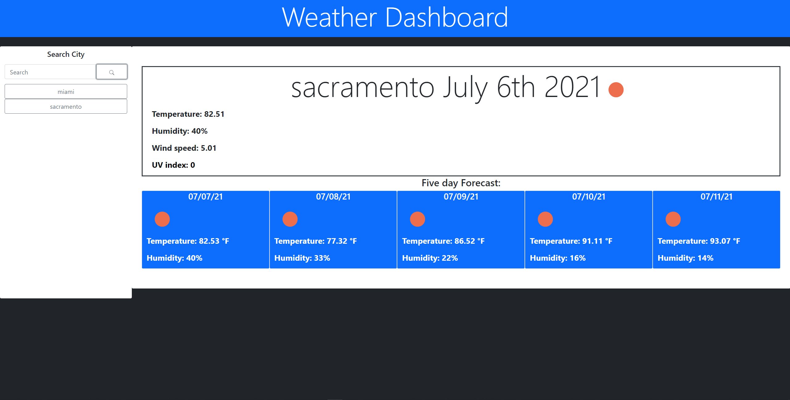
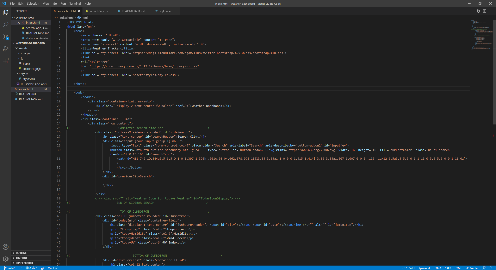
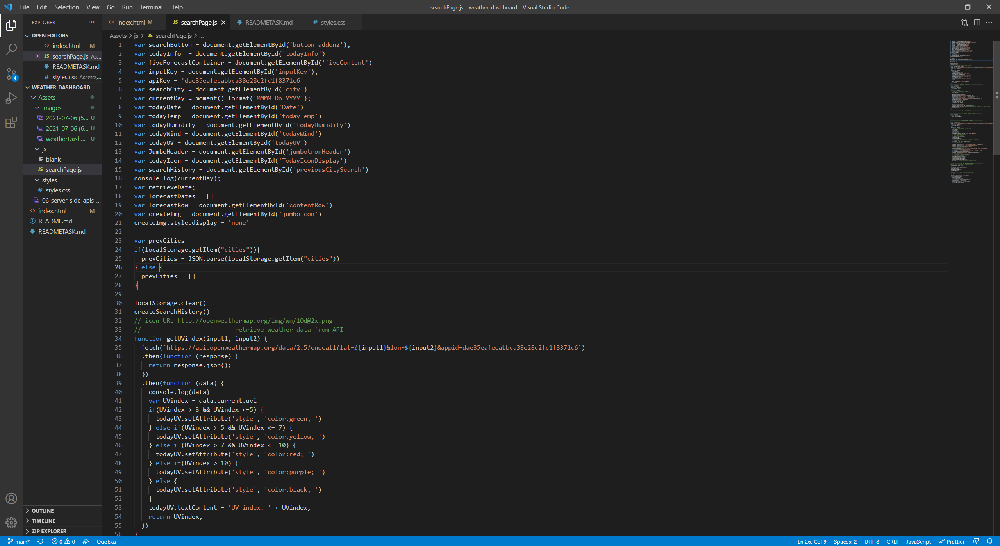

# Work Day Scheduler

## Introduction 

As the User, I want to be able to check what the weather is to my desired destinations. When I pull up my weather dashboard I would like to be able to search a location by city name and have information pertaining to the weather of that city displayed to me. I would also like to check what the weather will be over the next five days and want that information displayed to me as well in a neat and orderly fashion.

This weather dashboard displays information pertaining to the searched city, and saves this data to a search history. This page was built using the css framework bootstrap, HTML, Javascript, Jquery, and standard css. Most of the data is persistent and stored within the windows localstorage in order to keep track of user interactions.

The base structure of the application was formulated within the index.html file. The elements created within the base HTML are meant to add content to the jumbotron and the five day forecast div element. Half of the index.html page was used to implement the many script tags used for the functionality. These script tags link to jquery and the relative javascript file found in this application. 

The functionality of the application comes from the searchPage.js file where global variables are declared to point at id tags within index.html. The js file uses many functions, for loops, if statements and implements the data retrieved from a fetch of the openweathermap API. the getApi function operates by grabbing the user input and inserting it in the requestURL, once the data is retrieved, variables were declared as pointers for the index document to display the relevant data. moment.js was also used to grab the correct date to display for todays current weather and later implemented through the fiveday forecast. From this function, the latitude and longitude values are retrieved and sent to the UVIndex function in order to run a seperate fetch with those parameters. The UV index was a seperate function created because of the parameters and is checked against an if conditional statemet to display the correct color corresponding to severity. The getApi5day function is ran to display the five day forecast of the user search. This function takes the same input value and runs the fetch data through a loop to grab each corresponding day and weather, which is then put into a create element that gets appended to the page. 

## Deployed Application 

[Weather Dashboard](https://pn-barnes.github.io/weather-dashboard/)

[github Repository](https://github.com/PN-Barnes/weather-dashboard)

## Installation

[VS Code](https://code.visualstudio.com/)

[node.js](https://nodejs.org/en/)

[jQuery](https://code.jquery.com/)

[jqueryUI](https://jqueryui.com/)

[Bootstrap](https://getbootstrap.com/)

## References

[HTML](https://developer.mozilla.org/en-US/docs/Web/HTML)

[CSS](https://developer.mozilla.org/en-US/docs/Web/CSS)

[Javascript](https://developer.mozilla.org/en-US/docs/Web/JavaScript)

[Moment.js](https://momentjs.com/)

[window.localStorage](https://developer.mozilla.org/en-US/docs/Web/API/Window/localStorage)

[jquery](https://developer.mozilla.org/en-US/docs/Glossary/jQuery)

[bootstrap](https://getbootstrap.com/docs/5.0/getting-started/introduction/)

[Openweathermap](https://openweathermap.org/api)

## Credits

- - -
© 2021 Trilogy Education Services, LLC, a 2U, Inc. brand. Confidential and Proprietary. All Rights Reserved.
